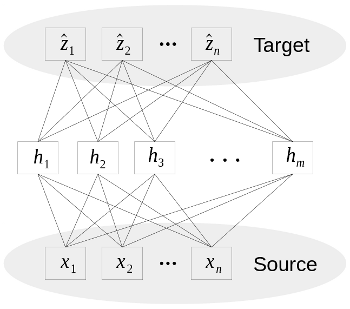

## Inductive Transfer Encoder

The induction transfer encoder (ITE) is an inductive transfer learning model that learns a general transformation that can be applied to transfer samples from a source domain to target domain. The ITE is essentially an autoencoder that takes as input a sample in the source domain and attempts to reconstruct the sample in the target domain:

<div align="center">
  
</div>

This repository contains the source code to reproduce the results in:

John V. Monaco and Manuel M. Vindiola. *Crossing Domains with the Inductive Transfer Encoder: Case Study in Keystroke Biometrics*. IEEE Eighth International Conference on Biometrics: Theory, Applications, and Systems (BTAS), 2016.

## Instructions

### Dependencies

Results were obtained with the following software versions:

```
> %watermark -v -p numpy,pandas,scikit-learn,tensorflow,seaborn
CPython 3.5.1
IPython 4.1.2

numpy 1.11.0
pandas 0.18.1
scikit-learn 0.17.1
tensorflow 0.8.0
matplotlib 1.5.1
seaborn 0.7.0
```

It is recommended to use [Anaconda](https://www.continuum.io/downloads) and create a virtual env with the above dependencies installed.

To reproduce the main results run the main.py script:

```
> python main.py
```

This will download and extract the datasets, set up the cross-domain verification scenarios, and train the ITE using each of the bipartite strategies. Depending on the hardware, it may take several hours to complete. The resulting scores files may also vary slightly depending on whether a GPU is used for parameter estimation.
